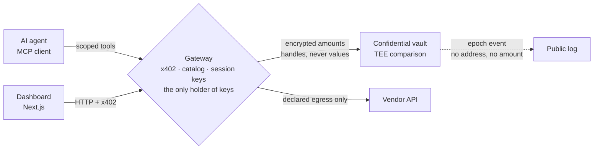
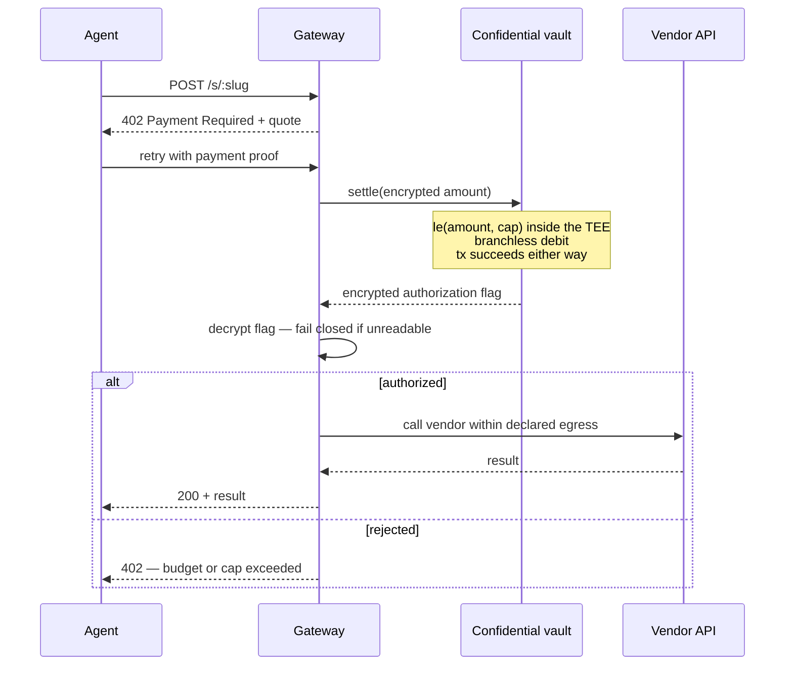
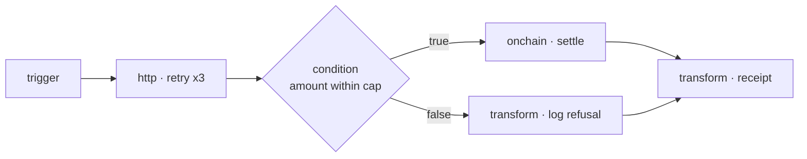
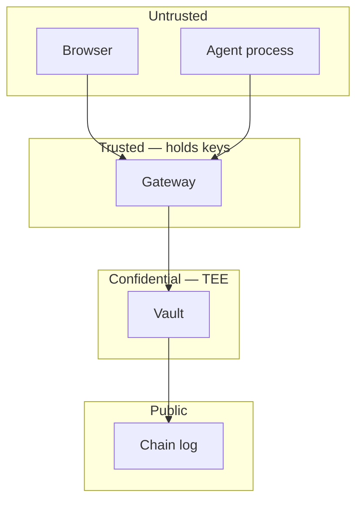

# Kairos — Architecture

**Status:** Draft v1.0
**Last updated:** 2026-08-01
**Companion documents:** [PRD](./PRD.md) · [Project structure](./PROJECT_STRUCTURE.md)

---

## 1. Architectural thesis

One sentence: **authority narrows at every hop, and plaintext stops before the chain.**

Every layer holds strictly less power than the one before it. The browser holds no keys. The agent holds a scoped, expiring session key. The gateway holds the decryption key but is bounded by a declared egress allowlist. The chain holds only handles.



---

## 2. Layers

| Layer | Holds | Cannot do |
|---|---|---|
| Browser / dashboard | Session cookie, display data | Decrypt anything, reach a vendor directly |
| Agent / MCP client | Scoped, expiring session key | Choose its own egress, exceed its cap, read another agent's spend |
| Gateway | Decryption key, relayer key, catalog | Call outside a manifest's declared egress |
| Confidential vault | Encrypted handles | Reveal a value, or reveal an authorization outcome |
| Public chain | Epoch numbers, relayer address | Reveal amounts, caps, balances, or counterparties |

---

## 3. The confidential authorization model

### 3.1 Why branchless

An encrypted boolean cannot gate a `require`. If a transaction reverted when a payment exceeded the cap, the revert itself would broadcast the comparison result — defeating the entire purpose. Authorization must therefore be **branchless**: the transaction succeeds identically whether or not the payment was authorized, and the outcome is written to an encrypted flag.

```solidity
ebool    withinCap = Nox.le(amount, s.capPerCall);
euint256 requested = Nox.select(withinCap, amount, zero);

// safeSub reports underflow as an encrypted flag rather than reverting,
// which would leak whether the treasury covered the payment.
(ebool funded, euint256 remaining) = Nox.safeSub(budget, requested);

euint256 debited = Nox.select(funded, requested, zero);
budget           = Nox.select(funded, remaining, budget);
```

An over-cap call debits **zero** and the transaction still **succeeds** — on-chain, indistinguishable from an authorized one.

### 3.2 Fail closed

The encrypted outcome flag is readable only by the owner and the agent it concerns. The gateway decrypts it, and **refuses the resource if the flag cannot be read**.

This is the load-bearing invariant of the whole system. A gateway that treated an unreadable flag as "probably fine" would hand out paid resources for free. Every code path that touches the flag must default to refusal.

### 3.3 Breaking the payment graph

Two design choices produce counterparty privacy:

1. **Settlement events carry no addresses and no amounts** — only an epoch number. Logs cannot be assembled into a payment graph.
2. **Debits batch.** They accumulate into an encrypted epoch total that the owner flushes as a single aggregate event. There is no one-transaction-per-API-call trail to correlate by timing.

---

## 4. The payment path



The `402` surface is unchanged from plain x402. An agent that has never heard of the confidential layer still works — it simply does not get the privacy.

---

## 5. The workflow engine

Beyond single calls, Kairos runs **workflows**: graphs of nodes an agent executes as one tool call.

The scheduling rule is one sentence, and everything else falls out of it:

> A node becomes **runnable** once every predecessor has settled, and **actually runs** if at least one incoming edge fired.

That single rule produces fan-out, join, and skip-propagation with no special "parallel" or "merge" node type. Nodes that become ready together simply execute together.



| Capability | Detail |
|---|---|
| Node kinds | `trigger` · `http` · `condition` · `onchain` · `delay` · `transform` · `loop` |
| Branching | `true` / `false` edges from a condition. An unbranched edge fires on pass only |
| Parallelism | Ready nodes run concurrently; a join waits for every upstream branch |
| Retry | Per-node max attempts with backoff; attempts reported per run |
| Timeout | Per-node deadline |
| Validation | Cycles, dangling edges, duplicate ids, missing entry points rejected at publish time |
| Guard | Hard stop at a bounded node-execution count per run |
| History | Every run persists per-node status, attempt count, duration |

---

## 6. Component responsibilities

| Component | Responsibility | Depends on |
|---|---|---|
| `packages/manifest` | Skill manifest parsing and validation — the capability contract | — |
| `packages/confidential` | Vault client: encrypt, settle, decrypt | contract ABI |
| `packages/chain` | Chain transfers, status, explorer links | — |
| `packages/authz` | Scoped session keys: issue, verify, revoke | — |
| `packages/workflow` | Graph engine, scheduler, template resolver, node kinds | `packages/chain` |
| `packages/sdk` | Typed client surface for the gateway API | shared types |
| `packages/shared` | Cross-cutting types, errors, result helpers | — |
| `apps/gateway` | HTTP API — x402, catalog, vault routes, workflow routes. **Sole key holder** | all packages |
| `apps/mcp-server` | Exposes published skills and workflows as MCP tools over stdio | `packages/sdk` |
| `apps/web` | Operator dashboard and marketing site | `packages/sdk` |
| `services/*` | Persistence, metering, execution, identity, chain writes | `packages/*` |
| `contracts` | Confidential vault contract, tests, deployment scripts | — |

**Dependency rule:** `apps` may depend on `packages`. `packages` may depend on other `packages` and on `shared`. `packages` must never depend on `apps`. `contracts` depends on nothing in the workspace.

---

## 7. Trust boundaries



Crossing rules:

- Nothing crosses from **Trusted** to **Untrusted** except display data and explicit decryptions the requester is permitted to see.
- Nothing crosses from **Confidential** to **Public** except epoch numbers and event counts.
- Every crossing from **Untrusted** to **Trusted** is authenticated by a scoped session key and validated against a schema at the boundary.

---

## 8. Data model (conceptual)

| Entity | Key fields | Confidentiality |
|---|---|---|
| Treasury | budget, epoch, epoch total | Encrypted; owner-decryptable |
| Agent | id, cap per call, cumulative spend, active | Cap and spend encrypted; ACL-gated |
| Skill | slug, manifest, price, egress scope, vendor | Public |
| Settlement | epoch, encrypted amount, encrypted outcome | Amount and outcome encrypted |
| Session key | id, agent, scope, expiry, revoked | Server-side only |
| Workflow | slug, graph (nodes, edges), version | Public to the operator |
| Run | workflow, per-node status, attempts, duration | Operator-visible |

---

## 9. Cross-cutting concerns

| Concern | Approach |
|---|---|
| **Configuration** | Environment-driven, validated at startup by a schema. The process refuses to boot on invalid config rather than degrading silently. |
| **Errors** | Typed error taxonomy at the package boundary; HTTP mapping at the gateway edge only. No raw exception text reaches a client. |
| **Validation** | Every external input parsed by a schema at the boundary. Internal code receives parsed types, never raw payloads. |
| **Logging** | Structured, with a request id propagated across hops. **No secret, key, or decrypted amount is ever logged.** |
| **Testing** | Unit tests on authorization and scheduling logic; contract tests on the vault including over-cap and underflow; integration tests on the 402 path; end-to-end on the operator flows. |
| **Demo mode** | An explicit boolean sourced from one place and surfaced identically to the dashboard and the API, so the UI cannot claim a real settlement while running against a stub. |

---

## 10. Deployment topology

| Environment | Web | Gateway | Chain |
|---|---|---|---|
| Local | dev server | local process | demo mode or testnet |
| Preview | edge deploy | container | testnet |
| Production | edge deploy | container behind TLS reverse proxy | testnet / mainnet |

Only the gateway holds keys, so it is the only component with a secret-bearing deployment. The web app ships with public configuration only.

---

## 11. Architecture decisions

Recorded as ADRs in `docs/adr/`. The load-bearing ones:

| ADR | Decision |
|---|---|
| ADR-001 | Branchless authorization instead of reverting comparisons |
| ADR-002 | Fail closed on an unreadable authorization flag |
| ADR-003 | Batch debits into epochs rather than settling per call |
| ADR-004 | Single gateway relayer, with the resulting exposure documented |
| ADR-005 | Keep x402 and MCP wire formats unchanged |
| ADR-006 | Graph scheduling by a single predecessor rule rather than typed parallel nodes |

---

## 12. Known limitations

Carried verbatim from the PRD, because architecture documents that omit them mislead.

- `msg.sender` is inherently public. The relayer address is visible, and the relayer learns what it relays.
- The occurrence of a settlement and its epoch are public.
- Flushed batch size is visible.
- Batching mitigates but does not eliminate timing correlation on a low-traffic deployment.
- The gateway is trusted; compromising it compromises confidentiality for calls it handles.
